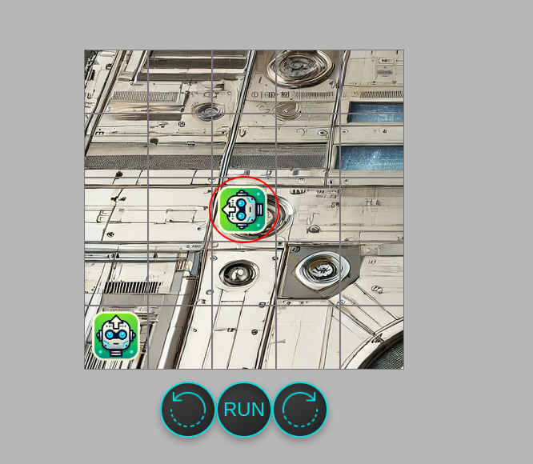

# TOY ROBOT Simulator
A robot simulator where you can navigate a platform together with your friends.

## Client Side

### CLI
You can connect via TCP and navigate using the CLI:
``telnet 159.65.236.207 5001``
#### Commands
- PLACE X Y F - Start the robot at the given coordinates, ex: PLACE 1 1 NORTH
- MOVE - Moves in the direction of the robot
- LEFT - Rotate the robot 90º to the left
- RIGHT  - Rotate the robot 90º to the right
- REPORT - Current position of the robot

  
### Front End

You can navigate through the interface at:
http://159.65.236.207:8080/

#### Bonus - Multiplayer
Invite your friends to navigate with you! Yes, it's possible to play online together!

